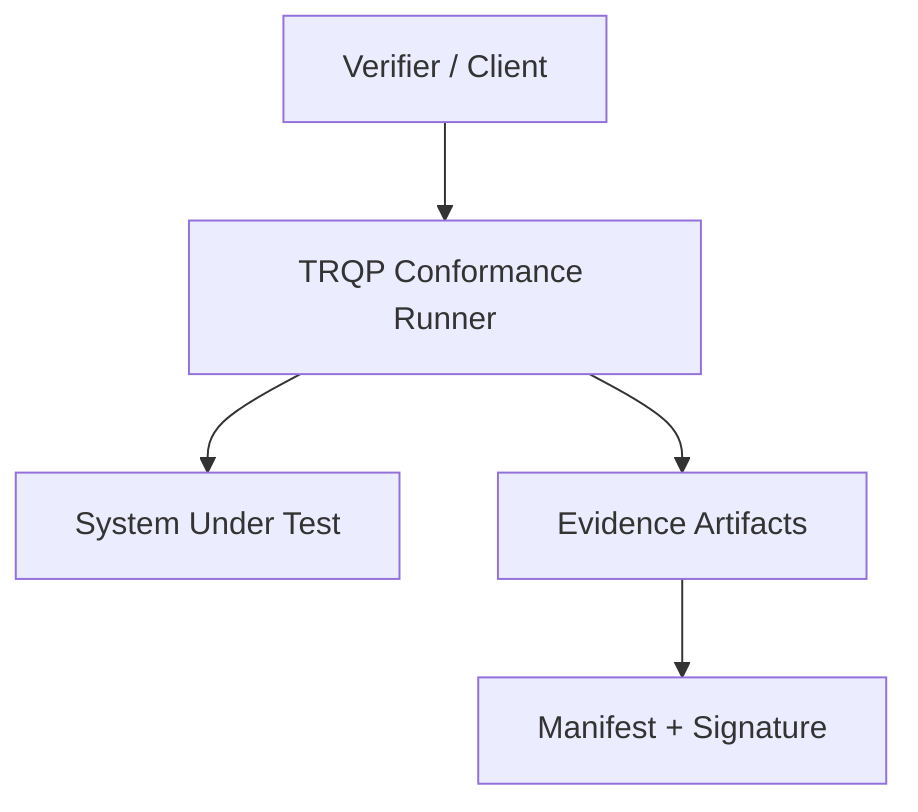

# TRQP Conformance Suite


## Start here: TRQP Assurance Hub

Looking for the *single front door* across TRQP conformance + security/privacy assurance?

- Hub repo (onboarding, operating model, combined workflows): https://github.com/sankarshanmukhopadhyay/trqp-assurance-hub


## Assurance Level Semantics

This repository **consumes** Assurance Level (AL1–AL4) semantics from the **TRQP Assurance Hub**.

- Canonical definitions: `docs/guides/assurance-levels.md` (in the Hub)
- Machine-readable contract: `al-contract.json`

This suite parameterizes tests and evidence templates by AL but **MUST NOT** redefine AL meanings locally. For audit stability, this repo includes an `al-contract.json` with the SHA-256 of the canonical AL definition document (`61c599c5fa06e0c9110f40ff71c0174db5502105b97f1391dbd9ae8548115f71`).

Conformance Test Suite for the Trust Registry Query Protocol (TRQP).

This repository provides a profile-driven, evidence-oriented testing framework to validate TRQP implementations for interoperability, determinism, lifecycle correctness, and operational readiness.

This is an independent, open reference implementation. It is not an official artifact of the Trust over IP Foundation. The goal is to support ecosystem alignment and accelerate production-grade conformance discussions.

---

## Start Here

Choose the path that matches your role:

- **TRQP implementer**: run the **Baseline** profile, review `docs/START_HERE.md`, then compare results to the reference reports in `docs/reference-reports/`.
- **Spec author / working group participant**: review `docs/TRQP_Conformance_Philosophy.md` and `docs/ROADMAP.md` to see how requirements map to executable tests and evidence.
- **Ecosystem / governance / assurance**: read `docs/SOCIALIZING_NOTES.md`, `docs/evidence_bundles.md`, and the Hub crosswalk (`docs/hub-crosswalk.md`) to understand the evidence contract and profile model.

---


## Evidence artifacts produced by CTS

CTS produces a **self-describing evidence bundle** per run under `reports/<run-id>/`.

For a fast deterministic sanity check, use the **Smoke** profile: `profiles/smoke.yaml`. The bundle includes a machine-readable descriptor (`bundle_descriptor.json`) that indexes artifacts using canonical `kind` labels (aligned where possible with the Assurance Hub / TSPP vocabulary).

| Canonical kind | Produced by CTS | Where in bundle | Notes |
|---|---:|---|---|
| `cts_bundle_descriptor` | Yes | `bundle_descriptor.json` | Bundle index (paths + hashes). Includes Hub-aligned `artifact_kind` values. |
| `cts_checksums` | Yes | `checksums.json` | SHA-256 checksums for key artifacts. |
| `cts_run_json` | Yes | `run.json` | Run metadata (profile, SUT, timing, tool version) |
| `cts_verdicts` | Yes | `verdicts.json` | Per-test verdicts |
| `cts_manifest` | Yes | `manifest.json` | Hash manifest for integrity verification |
| `cts_manifest_sig` | Profile-dependent | `manifest.sig` | Present for high-assurance profiles when signing enabled |
| `cts_case_file` | Yes | `cases/<case-id>.json` | Captured case transcript (requests/responses/notes where applicable) |
| `cts_bundle_zip` | Profile-dependent | `bundle.zip` | Convenience zip of the run directory |
| `jwks_snapshot` | Sometimes | `cases/...` | Emitted when a test case captures JWKS material; referenced via `bundle_descriptor.json` when present |
| `signed_response_sample` | Sometimes | `cases/...` | Emitted when a test captures a signed response envelope |

For auditors and integrators, treat `bundle_descriptor.json` as the **index of record** for what was produced and how to reference it downstream.

## Why This Exists

Specifications describe behavior. Deployments require proof.

TRQP is designed as a lightweight verification rail across trust ecosystems. Without structured conformance testing, implementations may diverge in subtle but critical ways:

- Non-deterministic authorization outcomes
- Inconsistent lifecycle semantics
- Fragmented security posture
- Weak or undefined error modeling
- “Pass” results without verifiable evidence

This suite addresses those risks through executable, assertion-based testing.

---

## What You Get

- **Profiles** that scale assurance without changing core protocol semantics
  - Baseline, Enterprise, High-Assurance
- **Requirement IDs** mapped to executable tests
- **Deterministic verdict model** (PASS/FAIL/INCONCLUSIVE/NOT_APPLICABLE)
- **Evidence bundles** that are audit-friendly
  - transcripts, canonical payloads, hashes, manifest
  - signatures for High-Assurance runs (where configured)

---

## Core Principles

### Profile-Based Conformance

Different ecosystems require different assurance levels.

Profiles:

- **Baseline** — Minimal interoperable TRQP behavior
- **Enterprise** — Governance metadata and operational discipline
- **High-Assurance** — Deterministic state reference, replay resistance, stronger security enforcement

Profiles determine which requirements are mandatory.

---

### Assertion-Based Testing

Every normative requirement is mapped to:

- A stable requirement ID
- One or more executable tests
- Explicit pass/fail criteria
- Required evidence artifacts

A test does not pass without evidence.

---

### Deterministic Verdict Model

Each test produces one of:

- `PASS`
- `FAIL`
- `INCONCLUSIVE`
- `NOT_APPLICABLE`

Verdicts are derived from requirement-level assertions, not HTTP status codes.

---

### Evidence-First Reporting

Each test run generates:

- Canonicalized request/response pairs
- Full HTTP transcripts
- Hashes of payloads
- A structured verdict manifest
- A signed evidence bundle (High-Assurance profile)

This enables auditability and reproducibility.

---

## Why Determinism Matters

TRQP decisions depend on registry state.

If identical inputs can produce different outputs under unclear state conditions, interoperability collapses.

High-Assurance profile requires:

- A declared `state_reference`
- Controlled fixture conditions
- Deterministic decision behavior for identical inputs

Without stable state reference, semantic conformance cannot be validated.

---

## Conformance Architecture Overview



The runner executes profile-bound tests, captures transcripts, validates assertions, and produces a cryptographically verifiable evidence bundle.

---

## Repository Structure

```
profiles/         Conformance profiles
requirements/     Requirement catalog with stable IDs
tests/            Declarative test definitions
schemas/          JSON schemas for validation
cts/              Conformance test runner
examples/         Example TRQP-like service and configuration
docs/             Design philosophy and evidence model
```

---

## Running the Suite

### 1. Start the Example SUT

```
uvicorn examples.poc_service:app --reload
```

### 2. Run Baseline Profile

```
python cts/run.py   --profile profiles/baseline.yaml   --sut examples/sut.local.yaml   --out reports/run1
```

### 3. Run High-Assurance Profile

```
python cts/run.py   --profile profiles/high_assurance.yaml   --sut examples/sut.local.yaml   --out reports/runHA
```

---

## Evidence Artifacts

Each run produces:

```
reports/<run-id>/
  run.json
  verdicts.json
  manifest.json
  manifest.sig   (High-Assurance)
  cases/
  bundle.zip
```

The manifest includes cryptographic hashes of all artifacts.
High-Assurance profile signs the manifest for integrity verification.

See `docs/evidence_bundle.schema.json` for the evidence contract.

---

## Reference Reports

This repo includes sample evidence bundles under:

- `docs/reference-reports/sample_run_baseline/`
- `docs/reference-reports/sample_run_high_assurance/`

These are intended as concrete examples of what “good evidence” looks like, and how to verify manifests and signatures.

---

## Status

**Status:** Experimental

This repository is evolving and intended to inform structured conformance approaches for TRQP. It does not represent a formal certification authority.

---

## Roadmap

See `docs/ROADMAP.md`.

---

## Contributing

All additions must:

- Map to a requirement ID
- Produce structured evidence
- Respect profile definitions
- Avoid introducing undefined semantic assumptions

See `CONTRIBUTING.md` for guidelines.

---

## Strategic Positioning

This suite is intended to:

- Encourage interoperable TRQP implementations
- Support production-readiness discussions
- Provide a structured foundation for future conformance programs
- Reduce ambiguity in multi-ecosystem deployments

It does not assert normative authority over the TRQP specification.


## Repo hygiene and assurance artifacts

- Schema checks: `python scripts/schema_check.py`
- Preflight (optional): `python scripts/preflight.py --base-url https://your-sut/ --endpoint /.well-known/jwks.json`
- Traceability template: `docs/traceability.md`
- Evidence bundle guidance: `docs/evidence_bundles.md`


## Certification Baseline Alignment (CTR-ACB)

This repository is the **executable verification engine** for the *Candidate Trust Registry Assurance & Certification Baseline (CTR-ACB)* defined in the TRQP Assurance Hub.

In practice:

- The Assurance Hub defines **what** a trust registry claims (assurance profile, controls, lifecycle, recognition).
- The Conformance Suite provides **how to verify** those claims and produce evidence artifacts that can be referenced from:
  - Control Satisfaction Declarations
  - Certification Attestations (if/when an ecosystem chooses to operationalize certification)

See: `docs/certification-alignment.md`.
