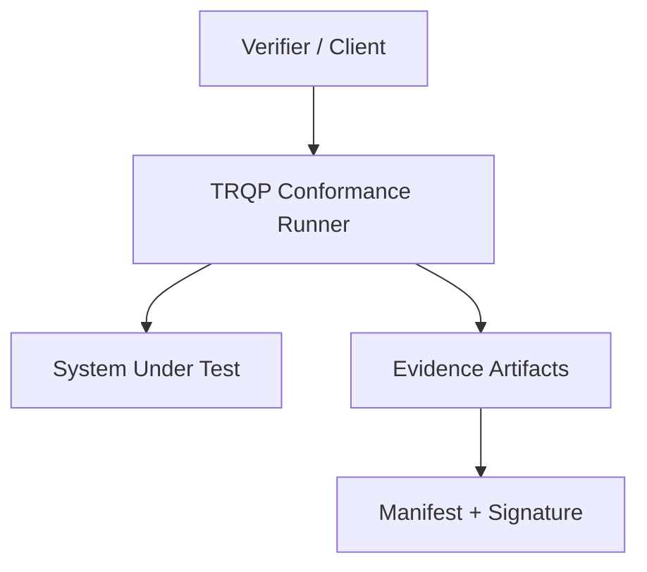

## Documentation

- Documentation governance: [`docs/governance/README.md`](docs/governance/README.md)

# TRQP Conformance Suite

> **Portfolio status:** Tier 1 flagship · Active · Beta

| Attribute | Value |
|---|---|
| Portfolio tier | Flagship |
| Lifecycle | Active |
| Primary role | protocol conformance engine |
| Primary output | Conformance Report and evidence bundle |
| Validation | `make validate` |
| Evidence output | See repository-specific output contract and examples |
| Governance authority | [`GOVERNANCE.md`](GOVERNANCE.md) |
| Stack adoption path | [`docs/trqp-adoption-path.md`](docs/trqp-adoption-path.md) |


📘 **Documentation site (GitHub Pages):** https://sankarshanmukhopadhyay.github.io/trqp-conformance-suite/

**Current version:** v1.6.0

**Release line:** Operational Trust Stack v1


The Conformance Suite is the **verification engine** in the three-repository Operational Trust Stack v1 release line.
It turns protocol expectations into repeatable execution, structured verdicts, bundleable evidence, and a machine-readable
**Conformance Report** that downstream assurance workflows can ingest directly.

## Where this fits

| Layer | Repository role | Primary output |
|---|---|---|
| TSPP | Posture computation | Posture Report |
| Conformance Suite | Protocol verification | Conformance Report |
| Assurance Hub | Assurance orchestration and publication | Combined Assurance Manifest |

## What is new in v1.6.0

v1.6.0 is the Conformance Suite portion of the **Operational Trust Stack Maturity Release**. It keeps CTS focused on protocol verification while adding the release governance and validation evidence expected of an adoption-ready test engine.

- Adds release governance that prevents low-signal CTS releases for minor wording or reference churn.
- Adds a release validation record covering documentation tests, schema checks, deterministic profile inspection, and evidence contract review.
- Adds change-intake criteria for requirement, profile, evidence, and compatibility changes.
- Refreshes cross-repo references for the Hub v1.9.0 / CTS v1.6.0 / TSPP v0.14.0 maturity tuple.
- Clarifies that CTS output is release-worthy when it improves executable conformance, evidence portability, interoperability, or adopter evaluation.

## Prior release: v1.4.0

- Adds a TIS evidence contract that maps CTS reports, verdicts, manifests, and case files to TIS v0.10.0 evidence and conformance artifact roles.
- Extends evidence bundle descriptors with optional `tis_projection` metadata for Hub v1.7.0 ingestion.
- Adds sample TIS-compatible conformance declaration and evidence bundle manifest artifacts for the golden flow.
- Publishes portfolio release-impact and drift-review records for the coordinated Runtime Assurance Contract Pack.
- Cross-repo release references align with Assurance Hub v1.7.0 and TSPP v0.12.0.

## Start here

- Maturity release validation: [`docs/release-validation.md`](docs/release-validation.md)
- Release policy: [`docs/governance/release-policy.md`](docs/governance/release-policy.md)
- Change intake: [`docs/governance/change-intake.md`](docs/governance/change-intake.md)
- Operational stack overview: [`docs/operational-stack.md`](docs/operational-stack.md)
- TIS evidence contract: [`docs/tis-evidence-contract.md`](docs/tis-evidence-contract.md)
- Start here guide: [`docs/START_HERE.md`](docs/START_HERE.md)
- Quickstart: [`QUICKSTART.md`](QUICKSTART.md)
- Hub repo: https://github.com/sankarshanmukhopadhyay/trqp-assurance-hub

## Why this exists

A protocol is not operational just because a spec exists. This suite gives implementers a CI-friendly way to prove
what they satisfy, what they skipped, and how complete their evidence is. That matters because interoperability has a
nasty habit of collapsing into vibes unless someone makes the checks executable.

The TRQP ecosystem can evaluate **authoritative digital trust directories** (including sovereign registry patterns) by treating published directory artifacts as evidence.

This suite ships schemas and a lightweight validator:

- Docs: `docs/directory-artifact-validation.md`
- Tool: `scripts/validate_directory_artifacts.py`

## Release posture

v1.6.0 is additive and governance-focused. Existing v1.4.0 evidence bundle consumers remain compatible. Future CTS releases should be cut only for security fixes, broken validation, new executable conformance coverage, evidence contract changes, or coordinated Operational Trust Stack maturity increments.

## Start Here

Choose the path that matches your role:

- **TRQP implementer**: run the **Baseline** profile, review `docs/START_HERE.md`, then compare results to the reference reports in `docs/reference-reports/`.
- **Spec author / working group participant**: review `docs/TRQP_Conformance_Philosophy.md` and `docs/ROADMAP.md` to see how requirements map to executable tests and evidence.
- **Ecosystem / governance / assurance**: read `docs/SOCIALIZING_NOTES.md`, `docs/evidence_bundles.md`, and the Hub crosswalk (`docs/hub-crosswalk.md`) to understand the evidence contract and profile model.
- **Ayra registry operator**: run the `ayra_baseline` profile and see `docs/ayra-crosswalk.md` for the pre-certification evidence checklist.

---

## Local example configuration

The example SUT configuration is now shipped as `examples/sut.local.yaml.example`. Copy it to `examples/sut.local.yaml` and generate a fresh Ed25519 signing key before running the high-assurance profile locally.

## Evidence artifacts produced by CTS

CTS produces a **self-describing evidence bundle** per run under `reports/<run-id>/`.

For a fast deterministic sanity check, use the **Smoke** profile: `profiles/smoke.yaml`. The bundle includes a machine-readable descriptor (`bundle_descriptor.json`) that indexes artifacts using canonical `kind` labels (aligned where possible with the Assurance Hub / TSPP vocabulary).

| Canonical kind | Produced by CTS | Where in bundle | Notes |
|---|---:|---|---|
| `cts_bundle_descriptor` | Yes | `bundle_descriptor.json` | Bundle index (paths + hashes). Includes Hub-aligned `artifact_kind` values. |
| `cts_checksums` | Yes | `checksums.json` | SHA-256 checksums for key artifacts. |
| `cts_run_json` | Yes | `run.json` | Run metadata (profile, SUT, timing, tool version) |
| `cts_verdicts` | Yes | `verdicts.json` | Per-test verdicts |
| `cts_manifest` | Yes | `manifest.json` | Hash manifest for integrity verification |
| `cts_manifest_sig` | Profile-dependent | `manifest.sig` | Present for high-assurance profiles when signing enabled |
| `cts_case_file` | Yes | `cases/<case-id>.json` | Captured case transcript (requests/responses/notes where applicable) |
| `cts_bundle_zip` | Profile-dependent | `bundle.zip` | Convenience zip of the run directory |
| `jwks_snapshot` | Sometimes | `cases/...` | Emitted when a test case captures JWKS material; referenced via `bundle_descriptor.json` when present |
| `signed_response_sample` | Sometimes | `cases/...` | Emitted when a test captures a signed response envelope |

For auditors and integrators, treat `bundle_descriptor.json` as the **index of record** for what was produced and how to reference it downstream.

## Why This Exists

Specifications describe behavior. Deployments require proof.

TRQP is designed as a lightweight verification rail across trust ecosystems. Without structured conformance testing, implementations may diverge in subtle but critical ways:

- Non-deterministic authorization outcomes
- Inconsistent lifecycle semantics
- Fragmented security posture
- Weak or undefined error modeling
- "Pass" results without verifiable evidence

This suite addresses those risks through executable, assertion-based testing.

---

## What You Get

- **Profiles** that scale assurance without changing core protocol semantics
  - Baseline, Enterprise, High-Assurance, Ayra Baseline
- **Requirement IDs** mapped to executable tests
- **Deterministic verdict model** (PASS/FAIL/INCONCLUSIVE/NOT_APPLICABLE)
- **Evidence bundles** that are audit-friendly
  - transcripts, canonical payloads, hashes, manifest
  - signatures for High-Assurance runs (where configured)

---

## Core Principles

### Profile-Based Conformance

Different ecosystems require different assurance levels.

Profiles:

- **Baseline** — Minimal interoperable TRQP behavior
- **Enterprise** — Governance metadata and operational discipline
- **High-Assurance** — Deterministic state reference, replay resistance, stronger security enforcement
- **Ayra Baseline** — Extends Enterprise for Ayra Trust Network pre-certification

Profiles determine which requirements are mandatory.

---

### Assertion-Based Testing

Every normative requirement is mapped to:

- A stable requirement ID
- One or more executable tests
- Explicit pass/fail criteria
- Required evidence artifacts

A test does not pass without evidence.

---

### Deterministic Verdict Model

Each test produces one of:

- `PASS`
- `FAIL`
- `INCONCLUSIVE`
- `NOT_APPLICABLE`

Verdicts are derived from requirement-level assertions, not HTTP status codes.

---

### Evidence-First Reporting

Each test run generates:

- Canonicalized request/response pairs
- Full HTTP transcripts
- Hashes of payloads
- A structured verdict manifest
- A signed evidence bundle (High-Assurance profile)

This enables auditability and reproducibility.

---

## Why Determinism Matters

TRQP decisions depend on registry state.

If identical inputs can produce different outputs under unclear state conditions, interoperability collapses.

High-Assurance profile requires:

- A declared `state_reference`
- Controlled fixture conditions
- Deterministic decision behavior for identical inputs

Without stable state reference, semantic conformance cannot be validated.

---

## Conformance Architecture Overview


```mermaid
graph TD
    A[Verifier / Client] --> B[TRQP Conformance Runner]
    B --> C[System Under Test]
    B --> D[Evidence Artifacts]
    D --> E[Manifest + Signature]
```

The runner executes profile-bound tests, captures transcripts, validates assertions, and produces a cryptographically verifiable evidence bundle.

---

## Repository Structure

```
profiles/         Conformance profiles (including ayra_baseline.yaml)
requirements/     Requirement catalog with stable IDs
tests/            Declarative test definitions
schemas/          JSON schemas for validation (including schemas/ayra/)
cts/              Conformance test runner
examples/         Example TRQP-like service and configuration
docs/             Design philosophy, evidence model, and crosswalks
```

---

## Running the Suite

### 1. Start the Example SUT

```
uvicorn examples.poc_service:app --reload
```

### 2. Run Baseline Profile

```
python cts/run.py   --profile profiles/baseline.yaml   --sut examples/sut.local.yaml   --out reports/run1
```

### 3. Run High-Assurance Profile

```
python cts/run.py   --profile profiles/high_assurance.yaml   --sut examples/sut.local.yaml   --out reports/runHA
```

### 4. Run Ayra Baseline Profile

```
python cts/run.py   --profile profiles/ayra_baseline.yaml   --sut examples/sut.local.yaml   --out reports/ayra-run
```

---

## Evidence Artifacts

Each run produces:

```
reports/<run-id>/
  run.json
  verdicts.json
  manifest.json
  manifest.sig   (High-Assurance)
  cases/
  bundle.zip
```

The manifest includes cryptographic hashes of all artifacts.
High-Assurance profile signs the manifest for integrity verification.

See `docs/evidence_bundle.schema.json` for the evidence contract.

---

## Reference Reports

This repo includes sample evidence bundles under:

- `docs/reference-reports/sample_run_baseline/`
- `docs/reference-reports/sample_run_high_assurance/`

These are intended as concrete examples of what "good evidence" looks like, and how to verify manifests and signatures.

---

## Status

**Status:** Experimental

This repository is evolving and intended to inform structured conformance approaches for TRQP. It does not represent a formal certification authority.

---

## Roadmap

See `docs/ROADMAP.md`.

---

## Contributing

All additions must:

- Map to a requirement ID
- Produce structured evidence
- Respect profile definitions
- Avoid introducing undefined semantic assumptions

See `CONTRIBUTING.md` for guidelines.

---

## Strategic Positioning

This suite is intended to:

- Encourage interoperable TRQP implementations
- Support production-readiness discussions
- Provide a structured foundation for future conformance programs
- Reduce ambiguity in multi-ecosystem deployments

It does not assert normative authority over the TRQP specification.


## Repo hygiene and assurance artifacts

- Schema checks: `python scripts/schema_check.py`
- Preflight (optional): `python scripts/preflight.py --base-url https://your-sut/ --endpoint /.well-known/jwks.json`
- Traceability template: `docs/traceability.md`
- Evidence bundle guidance: `docs/evidence_bundles.md`


## Certification Baseline Alignment (CTR-ACB)

This repository is the **executable verification engine** for the *Candidate Trust Registry Assurance & Certification Baseline (CTR-ACB)* defined in the TRQP Assurance Hub.

In practice:

- The Assurance Hub defines **what** a trust registry claims (assurance profile, controls, lifecycle, recognition).
- The Conformance Suite provides **how to verify** those claims and produce evidence artifacts that can be referenced from:
  - Control Satisfaction Declarations
  - Certification Attestations (if/when an ecosystem chooses to operationalize certification)

See: `docs/certification-alignment.md`.

## UNTP Digital Identity Anchor (DIA)

Some authoritative directories use UNTP DIA for issuer identity anchoring. See [`docs/UNTP_DIA_SUPPORT.md`](docs/UNTP_DIA_SUPPORT.md).

### Supply chain integrity evidence

CTS supports evidence bundle descriptors that can include SBOM, build provenance, and Scorecard outputs for audit-ready evaluations.

## Experimental: DeDi support

The CTS ships an **experimental** DeDi artifact validator (schema checks) to support decentralized directory ecosystems.

- See `docs/profiles.md` and `profiles/dedi_experimental.yaml` (snapshot 2026-03-03).

- DeDi mapping matrix: `docs/reference/dedi-mapping-matrix.md`


## Operational Stack integration

CTS now emits `cts-report.json` in each report directory and supports `--run-id` and `--target-id` so the Assurance Hub can build a combined manifest without translation glue.

## TIS evidence projection

CTS v1.4.0 does not make Trust Infrastructure Schemas a runtime dependency. Instead, it exposes structured metadata that downstream tooling can project into TIS-compatible artifacts.

| CTS artifact | TIS role |
|---|---|
| `run.json` | conformance run metadata |
| `verdicts.json` | conformance verdict evidence |
| `manifest.json` and `checksums.json` | evidence bundle integrity metadata |
| `cases/*.json` | replayable test case evidence |
| `bundle_descriptor.json` | evidence index for Hub and TIS projection |

See `docs/tis-evidence-contract.md` for the mapping used by the coordinated v1.4.0 release.


## End-to-end assurance evidence chain

This repository participates in the coordinated TRQP Operational Trust Stack. The supported execution path binds CTS conformance evidence and TSPP posture evidence to the same `run_id` and `target_id`, then composes them through the Assurance Hub.

```bash
make validate
make assurance-check
```

The resulting artifacts are machine-readable and retain producer version, execution context, checksums, findings, and the repository authorised to remediate each finding. Example or self-generated evidence does not constitute independent certification. See [`PROJECT-STATUS.yaml`](PROJECT-STATUS.yaml) for maturity, authority, intended-use, and evidence declarations.
