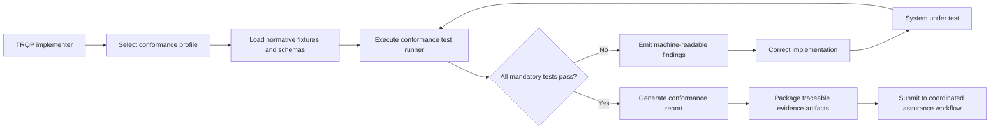

# Conformance assessment and evidence flow

The suite already contained architecture material, but the assessment lifecycle and its evidence boundary were not represented as a compact implementation-facing decision flow. This diagram links profile selection, execution, remediation, and assurance publication.

## Assurance interpretation

The diagram is normative only where it links to an identified specification, schema, profile, or executable test. Each transition should produce inspectable evidence: selected profile identifiers, test inputs, result artifacts, decision records, and publication manifests. Revocation or supersession must be represented by lifecycle data rather than by silently replacing prior evidence.
